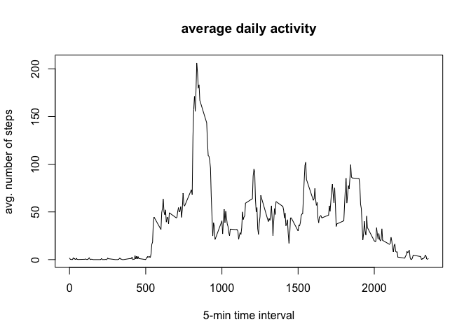
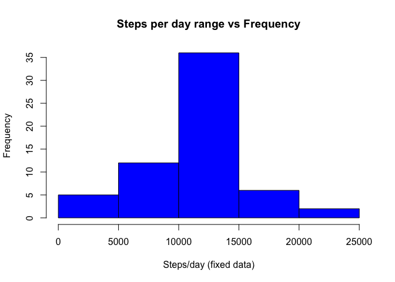

# Reproducible Research: Peer Assessment 1


## Loading and preprocessing the data

```r
dataFile <- "activity.csv"
zipFile <- "activity.zip"

# Data file present?
if (!file.exists(dataFile)) {
        # Extract zip file
        unzip(zipFile)
        if (!file.exists(dataFile)) {
                stop("Unable to find the data file. Please make sure that activity.zip or activity.csv file is present in the current working directory.")
        }
}

# Load data file
activityData <- read.csv(dataFile)

# Convert factor to date
activityData$date <- as.Date(activityData$date)

# Complete cases
activityDataCompleteCases <- activityData[complete.cases(activityData), ]

# Aggregate steps per day
activityDataStepsPerDay <- aggregate(activityDataCompleteCases$steps, by = list(Date=activityDataCompleteCases$date), FUN="sum")

# Aggregate steps per 5 minute interval across all days
activityDataStepsPerInterval <- aggregate(activityDataCompleteCases$steps, by = list(interval=activityDataCompleteCases$interval), FUN="mean")
```

## What is mean total number of steps taken per day?


```r
hist(activityDataStepsPerDay$x, col="red", xlab="Steps/day", main="Steps per day range vs Frequency")
```

 

```r
meanStepsPerDay <- mean(activityDataStepsPerDay$x)
medianStepsPerDay <- median(activityDataStepsPerDay$x)
```

**Steps per day**  

- Mean : 1.0766189\times 10^{4} 
- Median : 10765

## What is the average daily activity pattern?


```r
plot(activityDataStepsPerInterval$interval, activityDataStepsPerInterval$x, type="l", xlab="5-min time interval", ylab="avg. number of steps", main="average daily activity")
```

 

```r
# Maximum average number of steps in an interval across dates
maxStepsInInterval <- activityDataStepsPerInterval[which.max(activityDataStepsPerInterval$x),]$interval
```
5-minute interval, on average across all the days in the dataset, contains the maximum number of steps : 835

## Imputing missing values


```r
totalMissingRows <- nrow(activityData) - nrow(activityDataCompleteCases)

# Update missing data with avarage steps for that particular time interval
missingData <- activityData[is.na(activityData),]

missingData <- merge(missingData, activityDataStepsPerInterval, by=c("interval"))
missingData <- missingData[,c('x', 'date', 'interval')]

colnames(missingData) <- c("steps","date", "interval")
colnames(activityDataCompleteCases) <- c("steps", "date", "interval")

# Combine/Merge datasets
activityDataFixed <- rbind(missingData, activityDataCompleteCases)

# Fixed aggregate steps per day
fixedActivityDataStepsPerDay <- aggregate(activityDataFixed$steps, by = list(Date=activityDataFixed$date), FUN="sum")

# Histogram with fixed data
hist(fixedActivityDataStepsPerDay$x, col="blue", xlab="Steps/day (fixed data)", main="Steps per day range vs Frequency")
```

 

```r
fixedMeanStepsPerDay <- mean(fixedActivityDataStepsPerDay$x)
fixedMedianStepsPerDay <- median(fixedActivityDataStepsPerDay$x)
```
Total number of missing rows : 2304

**Steps per day**  

- Mean : 1.0766189\times 10^{4} 
- Median : 1.0766189\times 10^{4}

## Are there differences in activity patterns between weekdays and weekends?
