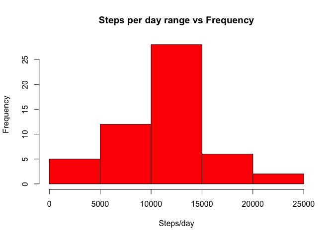

# Reproducible Research: Peer Assessment 1


## Loading and preprocessing the data

```r
dataFile <- "activity.csv"
zipFile <- "activity.zip"

# Data file present?
if (!file.exists(dataFile)) {
        # Extract zip file
        unzip(zipFile)
        if (!file.exists(dataFile)) {
                stop("Unable to find the data file. Please make sure that activity.zip or activity.csv file is present in the current working directory.")
        }
}

# Load data file
activityData <- read.csv(dataFile)

# Convert factor to date
activityData$date <- as.Date(activityData$date)

# Complete cases
activityDataCompleteCases <- activityData[complete.cases(activityData), ]

# Aggregate steps per day
activityDataStepsPerDay <- aggregate(activityDataCompleteCases$steps, by = list(Date=activityDataCompleteCases$date), FUN="sum")
```

## What is mean total number of steps taken per day?


```r
hist(activityDataStepsPerDay$x, col="red", xlab="Steps/day", main="Steps per day range vs Frequency")
```

 

```r
meanStepsPerDay <- mean(activityDataStepsPerDay$x)
medianStepsPerDay <- median(activityDataStepsPerDay$x)
```

**Steps per day**  

- Mean : 1.0766189\times 10^{4} 
- Median : 10765

## What is the average daily activity pattern?


## Imputing missing values


## Are there differences in activity patterns between weekdays and weekends?
